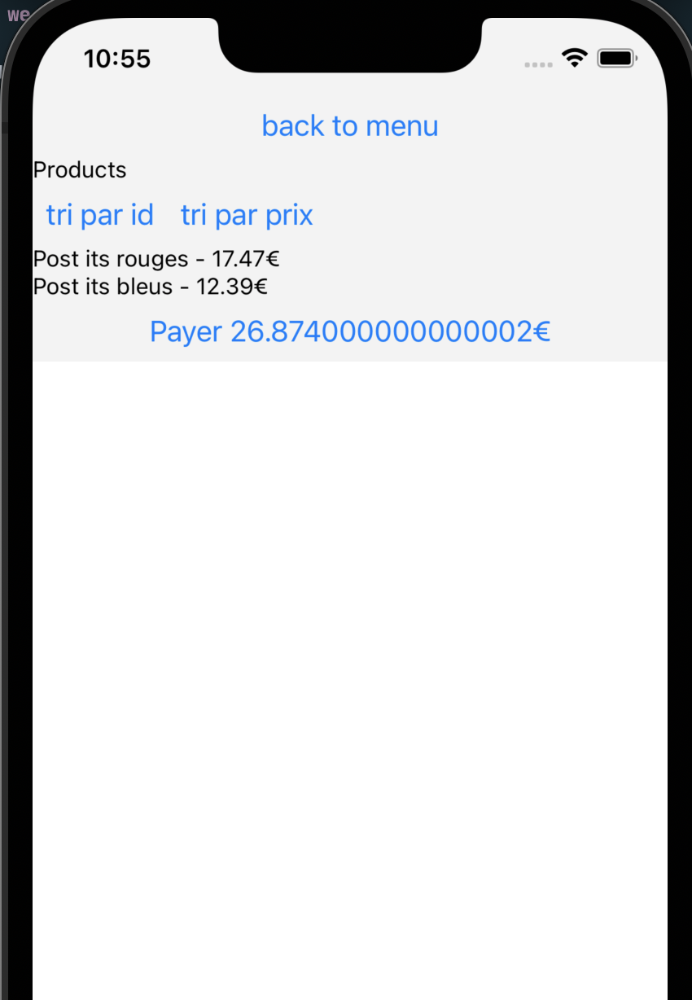

# DDD

## What we are trying to do

We display a list of products with their price coming from a fake API. There can be a discount applied to the products.

There is a button at the bottom displaying the total amount of the basket.

## Problems

### Applying a discount does not display a round price

Even if we manipulate price in cents to avoid rounding issues (such as `0.2 + 0.1 = 0.30000000002`), we forgot to be cautious about the discount!
Make use of TS brands to prevent from displaying a number that is not a price in cents.

### Actually, a discount can be applied to one product only

Ah! That wasn't in the initial requirement, but when testing the app the product team realised the case where a discount is applied to 1 product only is not applied!
In this case, the discount must be applied directly in the displayed price - it should be transparent to the user.

To test this case, change the basketId to `2`.

Make use of adapters to make this change safely :)

### Aaaargh, a mega Beatles fan finds their app really slow

There is a super Beatles fan that purchased 2000 Beatles albums.
However, when they try to order their products by price, the app is really slow.

To test this case, change the basketId to `3`.

Normalise the data to make it faster :)
