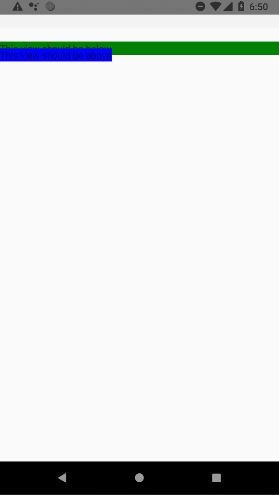
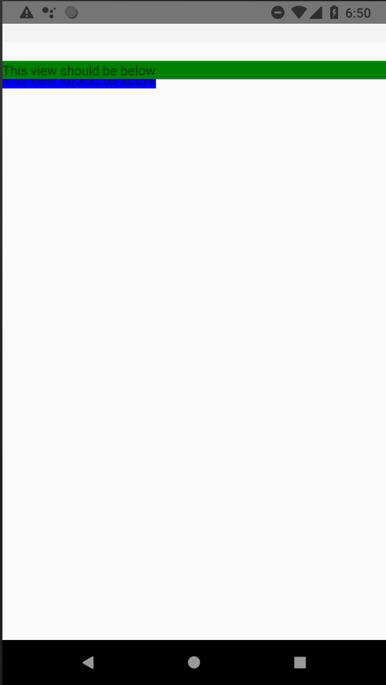

# z-index is not working on Android?!

## What is expected

The blue `View` should be above the green one as it has a higher z-index.



## What happens

The blue `View` is below



# FastImage is broken on Android :(

## What is expected

When I press the button to preload "/toto.png", nothing happens as it is not a valid URL (or I see a warning message)

## What happens

When I press the button to preload "/toto.png" the app crashes on Android (it doesn't on iOS)

# My test is broken

When you launch the test, there is an error :

```
 FAIL  __tests__/App-test.js (6.915 s)
  ✕ renders correctly (4095 ms)

  ● renders correctly

    TypeError: Cannot read property 'preload' of undefined

      64 |           title="Click to preload https://google.com/toto.png"
      65 |           onPress={() => {
    > 66 |             FastImage.preload([{uri: 'https://google.com/toto.png'}]);
         |                       ^
      67 |           }}
      68 |         />
      69 |       </View>

      at Object.preload (node_modules/react-native-fast-image/dist/index.cjs.js:96:58)
      at onPress (App.js:66:23)
      at node_modules/@testing-library/react-native/build/fireEvent.js:94:19
      at batchedUpdates (node_modules/react-test-renderer/cjs/react-test-renderer.development.js:13452:12)
      at act (node_modules/react-test-renderer/cjs/react-test-renderer.development.js:15280:14)
      at invokeEvent (node_modules/@testing-library/react-native/build/fireEvent.js:93:20)
      at Function.press (node_modules/@testing-library/react-native/build/fireEvent.js:101:33)
      at Object.<anonymous> (__tests__/App-test.js:15:13)
```

How do I make this test pass?

Bonus: how do I actually check something interesting in this test?
