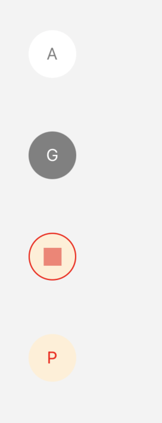

# Single Responsibility principle

## What we are trying to achieve

An app with 4 different styles of buttons.
The basic button has a few custom properties:

- icon
  - can be a name (in this case we display a letter to symplify)
  - can be a component and in this case we have a border
- disabled
- color scheme

## The issue

The code is not very re-usable. Everytime we want a button we have to specify the color. The disabled style has to be handled every time at the parent level.

Let's try to think about the responsibilities and how we can make it easier.
